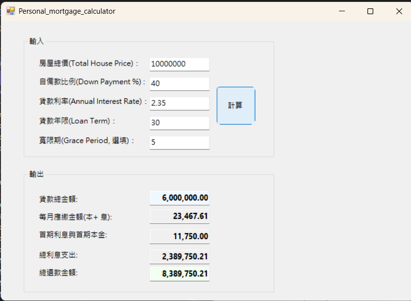

# Personal_mortgage_calculator個人房貸試算器1133334

## Personal_mortgage Calculator (WinForms)
This is a desktop application developed using C# Windows Forms, designed to help users accurately calculate various financial indicators related to their mortgage payments. By inputting the home price, interest rate, and grace period, the program automatically calculates the monthly payment amount and total interest expense.

## Features
**diverse input options**:  supporting core parameters such as total house price, down payment ratio, annual interest rate, and loan term. Grace period calculation: fully supports the financial logic of "interest-only payments during the grace period, with principal and interest repaid at maturity.

**Precise financial calculations**:All results are rounded to two decimal places and include thousands separator formatting (N2) for easier readability.

**Input validation**: Built-in error prevention mechanism ensures that the value is valid and greater than zero, preventing program crashes.

**Modern UI**: It adopts rounded corner design and visual highlights to clearly distinguish between the "input area" and the "result area".

## Calculation logic description

1. Total loan amount(P) = Total house price × (1 - Down payment)%

2. Monthly Payment = P x r(1 + r)^r / (1 + r)^n - 1 (Where r is the monthly interest rate, and n is the remaining number of repayment periods)

3. Total Interest = Grace Period Interest + Remaining Principal and Interest - P

## Installation and Execution

1. Ensure that the .NET Framework execution environment is installed on your computer.

2. Download the source code for this project.

3. Open the .sln project file using Visual Studio.

4. Press F5 or click the "Start" button to compile and run.

## Screenshots

